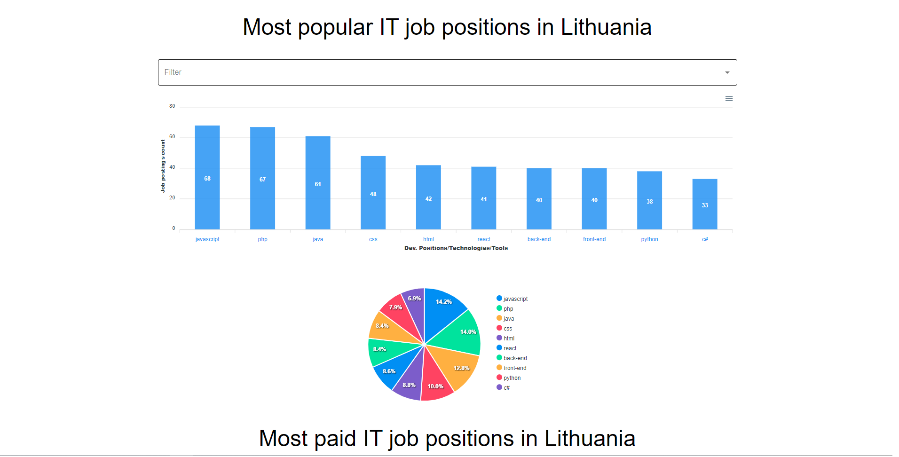

# LtItJobStatistics

This website was made to research the trends of technologies/tools mentioned in IT job adverts. You can see generated charts from data we gathered, the default charts are of top 10 technologies in the database, but there is a filter if you want to view different data, feel free to check out 😎.



# Link to live version

https://ltitjobstatistics.herokuapp.com

# For this project we used:

- Client side - React.js
- Server side - Node.js
- Scraping data - Puppeter library
- Database - MongoDB/Mongoose
- Node.js Framework - Express.js

## Installation

```sh
npm install && cd client && npm install && cd ..
npm run dev
```

## Meta

Domantas Mikelionis - https://github.com/DomantasMk / https://www.linkedin.com/in/domantas-mikelionis-36aa84172/  
Tautvydas Gustas - https://github.com/TautvydasGustas1 / https://www.linkedin.com/in/tautvydas-gustas/

## Contributing

1. Fork it
2. Create your feature branch (`git checkout -b feature/fooBar`)
3. Commit your changes (`git commit -am 'Add some fooBar'`)
4. Push to the branch (`git push origin feature/fooBar`)
5. Create a new Pull Request
